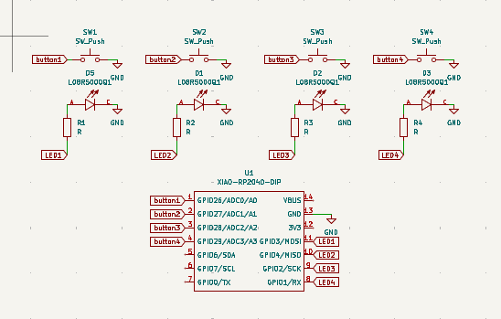
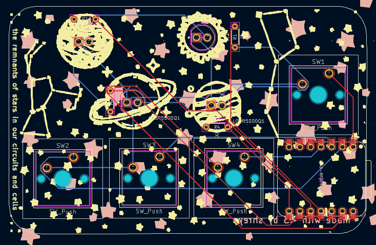
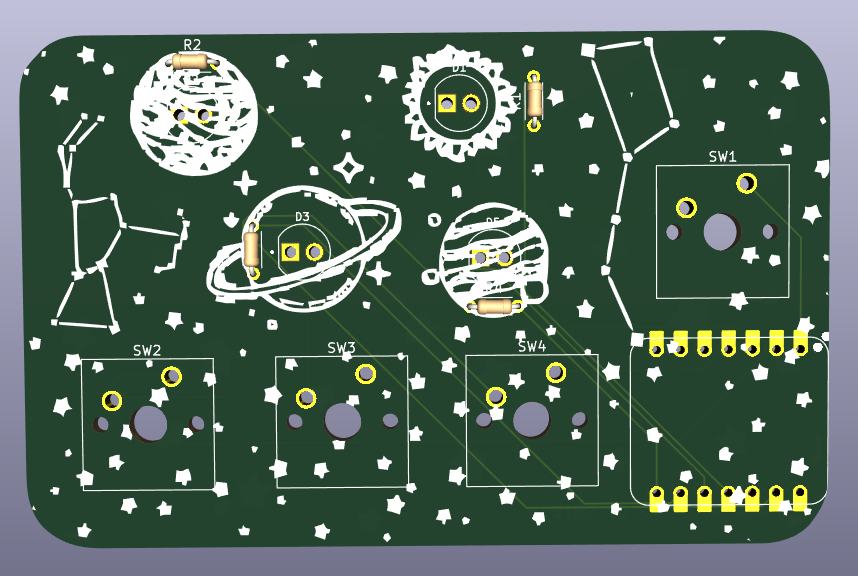
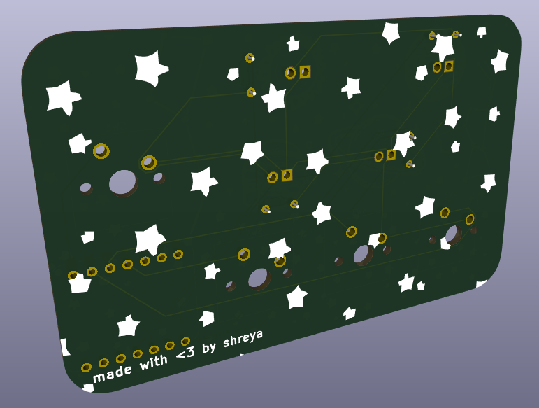

# Pioneer: a space-themed fidget board! 🚀

First of all, thank you Meghana for the awesome YSWS https://pathfinder.hackclub.com/! We stan Meghana <3

This is a board I made for the Pathfinder YSWS by Hack Club. And now for a mini yap session
about the name and why I chose it:

## Inspiration ✨
The word Pathfinder inspired the word Pioneer, and since I knew I wanted four buttons (and of course four LEDs), I used each of the buttons to represent the different "eras" of exploration. Here were the four symbols I came up with (which I will paint on the four buttons): a foot 👣 (whenever I say foot y'all I mean the footprint, not an actual foot 😭 I realized that a little late so I added emojis in here for visualization), a compass 🧭, a train 🚂, and a rocket 🚀. Each era, when activated, makes the LEDs do something new depending on what script you are in.

And then of course the empty space was kind of sad, so I thought, why not add stars and planets? The final design has three LEDs as planets, one as the sun (so 4 LEDs total), a couple constellations silkscreened onto it, and a LOT of stars. Plus, of course, the four buttons. The rocket one couldn't fit in a neat little row with the other three, so it's hovering above the XIAO microcontroller. Which I convinced myself was fitting because it looks like it's launching into space. 

My final goal for making this project was to learn get more experience with PCBs on Kicad and microcontrollers (especially before I dived into HackPad and potentially more complicated hardware projects in the future)! And there are multiple scripts you can run on this board, which I will explain below.

So, as it turns out... this board doesn't just have one script you can run on it. Or two, or three. It has four! Here are the four scripts you can run, and what the four buttons do in each of them:

### Awaken 🌞
This is the first script I wrote for this board. It's a nice little animation script, where the LEDs seem to dance. Since it was the first script, it was like the "awakening" of the board, hence the name (the other name idea I had was "Bling" since it makes the LEDs go blingy blingy and look pretty). Here are what each of the buttons do in this script:

| Button     | Description |
|----------|-------------|
| 👣 Foot   | Turns on the sun (LED4) with a soft pulse. Press again to turn it off. |
| 🧭 Compass | Starts a slow orbit animation of the three planet LEDs around the sun. Press again to reverse direction |
| 🚂 Train  | LEDs blink in rhythm to a steady beat |
| 🚀 Rocket | Like a little launch sequence: the four LEDs light up in order, then all flash flash and stay on. |

### Signal 📡
This script is all about Morse code! Here’s how it works:
| Button     | Description |
|----------|-------------|
| 👣 Foot   | adds a dot to the message (short blink)|
| 🧭 Compass | adds a dash to the message (long blink) |
| 🚂 Train  | pressed once, adds an inter-letter space (gap). pressed twice in a row adds an inter-word space (longer gap) |
| 🚀 Rocket | sends the Morse code message, the LEDs start flashing |

### Orbit 🌌
This script is a timer that can be used to count down from any number of minutes, in intervals of 5, from 5 to 60 minutes. Here is what the buttons do:
| Button     | Description |
|----------|-------------|
| 👣 Foot   | adds 5 minutes per press. wraps at 60 mins. The LEDs light up in intervals to kind of show how much time has been added|
| 🧭 Compass | pauses or unpauses the timer. when paused, all the LEDs flash slowly. |
| 🚂 Train  | flashes all LEDs 3 times, then resets everything. time = 0, LEDs off|
| 🚀 Rocket | starts the timer! before starting, all currently lit LEDs flash twice. then they stay on, and countdown starts|

What are the time intervals? Here’s how the LEDs light up:
- 5 to 19 min -> LED1
- 20 to 34 min -> LED1 + LED2
- 35 to 49 min -> LED1 + LED2 + LED3
- 50 to 60 min -> all 4 LEDs

### Moonlight 🌚
This script creates a calming moonlight effect that can be used for meditation or as a nightlight! 
There are four modes:
- 🌫️ Mist — unified breathing; the LEDs pulse
- 🌊 Tide — all the LEDs turn on, then all go off, one by one.
- ✨ Firefly — independent LED rhythms
- 🌙 Moonlit — triggered by TRAIN, one LED pulses softly and shifts on press

Here's what each of the buttons do:

| Button     | Description |
|----------|-------------|
| 👣 Foot   | cycles the brightness between off -> low -> medium -> high  |
| 🧭 Compass | pauses or unpauses the animation of the lights (whereever they are in the cycle)|
| 🚂 Train  | starts/controls Moonlit mode |
| 🚀 Rocket | cycles modes between mist, tide, and firefly |

## Built With 🛠️

- Seeed Studio XIAO RP2040
- 4 tactile switches
- 4 LEDs
- A lot of trial and error

I used KiCad for the PCB, and VSCode with Arduino for the firmware part of it.

## Learning 🌱
This wasn't my first time using KiCad, but it was my first time using the XIAO microcontroller. I also learned how to write firmware for it using Arduino. The hardest part was figuring out the logic for the scripts, considering I had so many moving parts and buttons to handle, and to make sure that clicking two buttons at the same time didn't make the LEDs go wild. Overall, I learned how to use the XIAO RP2040, and will use this knowledge to make the HackPad, and how to write firmware (although as I understand, HackPad code uses either kmk or qmk).

## Images! 📸
Here is my schematic: 

And here's my PCB editor:

And here is the final look!:

