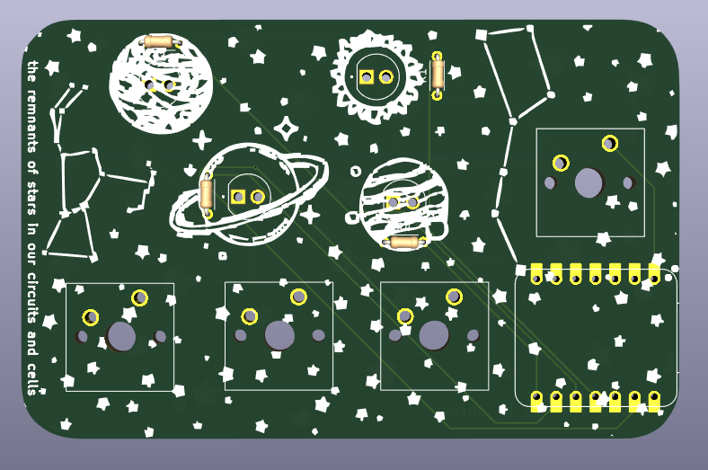
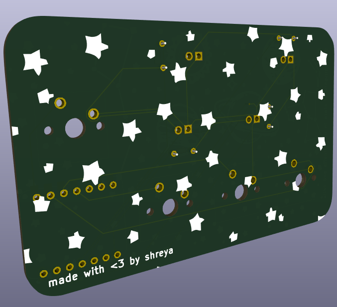

# Pioneer: a space-themed fidget board! 🚀

First of all, thank you Meghana for the awesome YSWS https://pathfinder.hackclub.com/! We stan Meghana <3

This is a board I made for the Pathfinder YSWS by Hack Club. And now for a mini yap session
about the name and why I chose it:

## Inspiration ✨
I heard the word Pathfinder and my thoughts jumped to an explorer trying to find their way in an unknown world. Then, of course, I went to brainstorming name ideas, and Pioneer stuck. I thought about the different "eras" of exploration, and came up with four symbols (which I will paint on the four buttons): a foot 👣, a compass 🧭, a train 🚂, and a rocket 🚀. Each era, when activated, makes the LEDs do something new.

And then of course the empty space was kind of sad, so I thought, why not add stars and planets? The final design has three LEDs as planets, one as the sun, and a couple constellations and a LOT of stars. 💖✨

My final goal for making this project was to learn get more experience with PCBs on Kicad and microcontrollers! And there are multiple scripts you can run on this board, which I will explain below.

## Functions ⚙️
So, as it turns out... this board doesn't just have one script you can run on it. It has four! Here are the four scripts you can run!

### Awaken 🌞
This is the first script I wrote for this board. It's a nice little animation script, where the LEDs seem to dance. Since it was the first script, it was like the "awakening" of the board, hence the name. Here are what each of the buttons do in this:

| Button     | Description |
|----------|-------------|
| 👣 Foot   | Turns on the sun (LED1) with a soft pulse. Press again to turn it off. |
| 🧭 Compass | Starts a slow orbit animation around the sun. Press again to reverse direction! |
| 🚂 Train  | LEDs blink in rhythm—either to a steady beat or synced to music via USB. |
| 🚀 Rocket | Launch sequence: LEDs light up in order, then all flash and stay on. |

### Signal 📡
This script is all about Morse code! It uses the buttons to send Morse code signals, and the LEDs blink to show the dots and dashes. Here’s how it works:
| Button     | Description |
|----------|-------------|
| 👣 Foot   | adds a dot (short blink)|
| 🧭 Compass | adds a dash (long blink) |
| 🚂 Train  | pressed once, adds an inter-letter space. pressed twice adds an inter-word space |
| 🚀 Rocket | sends the Morse code message! |

### Orbit 🌌
This script is a timer that can be used to count down from any number of minutes, in intervals of 5, from 5 to 60 minutes. Here is what the buttons do:
| Button     | Description |
|----------|-------------|
| 👣 Foot   | adds 5 minutes per press. wraps at 60 mins. The LEDs light up in intervals to kind of show how much time has been added|
| 🧭 Compass | pauses or unpauses the timer. when paused, all the LEDs flash slowly. |
| 🚂 Train  | flashes all LEDs 3 times, then resets everything. time = 0, LEDs off. |
| 🚀 Rocket | starts the timer! before starting, all currently lit LEDs flash twice. then they stay on, and countdown starts. they turn off in accordance with the time interval|

What are the time intervals? Here’s how the LEDs light up:
- 5 to 19 min -> LED1
- 20 to 34 min -> LED1 + LED2
- 35 to 49 min -> LED1 + LED2 + LED3
- 50 to 60 min -> all 4 LEDs

### Moonlight 🌜
This script creates a calming moonlight effect that can be used for meditation or as a nightlight! 
There are four modes:
- 🌫️ Mist — unified breathing, the LEDs pulse
- 🌊 Tide — like a layered wave, going in and out
- ✨ Firefly — independent LED rhythms
- 🌙 Moonlit — triggered by TRAIN, one LED pulses softly and shifts on press

Here’s how the buttons work:

| Button     | Description |
|----------|-------------|
| 👣 Foot   | cycles the brightness between off -> low -> medium -> high  |
| 🧭 Compass | pauses or unpauses the animation |
| 🚂 Train  | starts/controls Moonlit mode |
| 🚀 Rocket | cycles modes between mist, tide, and firefly |

## Built With 🛠️

- Seeed Studio XIAO RP2040
- 4 tactile switches
- 4 LEDs
- A lot of trial and error

I used KiCad for the PCB and Arduino for the firmware part of it.

## Struggles and Learning 🌱

This project was a mix of “wow this is working!” and “why is nothing working.” A few things I wrestled with:

- **Pin naming confusion**: In the code, I used `D0`, `D1`, etc. at first, but the XIAO RP2040 doesn’t recognize those in code. Turns out you just use numbers like `0`, `1`, `2` instead. Simple fix, but it tripped me up for a while.
- **State machines and mode switching**: I didn’t want a million global variables, so I learned how to use enums and clean logic to manage modes. It made the code way easier to read and extend!
- **Timing without delay()**: I had to learn how to use `millis()` to time animations without freezing everything else.

## Images! 📸
Here is my schematic: 

And here's my PCB:

